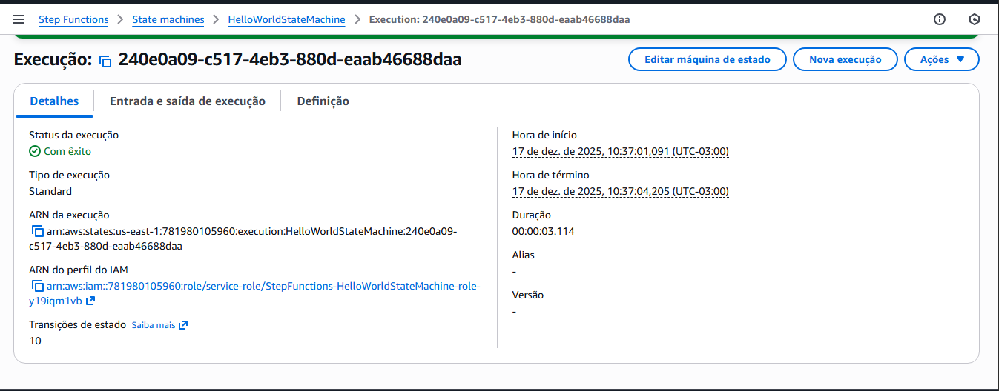

# Desafio DIO – AWS Step Functions

##  Sobre o Desafio
Este repositório foi criado como parte do desafio prático da DIO, com o objetivo de consolidar os conhecimentos adquiridos sobre workflows automatizados utilizando o serviço AWS Step Functions.

##  Objetivo
Aplicar os conceitos apresentados nas aulas em um ambiente prático, documentando a criação e execução de uma máquina de estados.

## ☁️ Serviços AWS Utilizados
- AWS Step Functions
- AWS IAM (role gerada automaticamente)

##  Atividades Realizadas
- Criação de uma State Machine do tipo Standard
- Execução do workflow Hello World
- Monitoramento da execução e verificação do status
- Análise das transições de estado
  
##  Exemplo de Workflow
Fluxo simples:
Início → Execução → Sucesso

##  Evidências
As capturas de tela demonstrando a criação da máquina de estados e a execução com sucesso do workflow estão disponíveis na pasta `/images`.
### Criação da State Machine

### Execução com Sucesso

##  Conclusão
Este desafio possibilitou compreender, de forma prática, como o AWS Step Functions pode ser utilizado para orquestrar processos automatizados de maneira visual, organizada e escalável.
